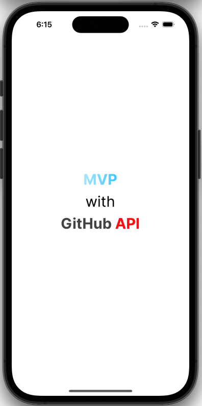
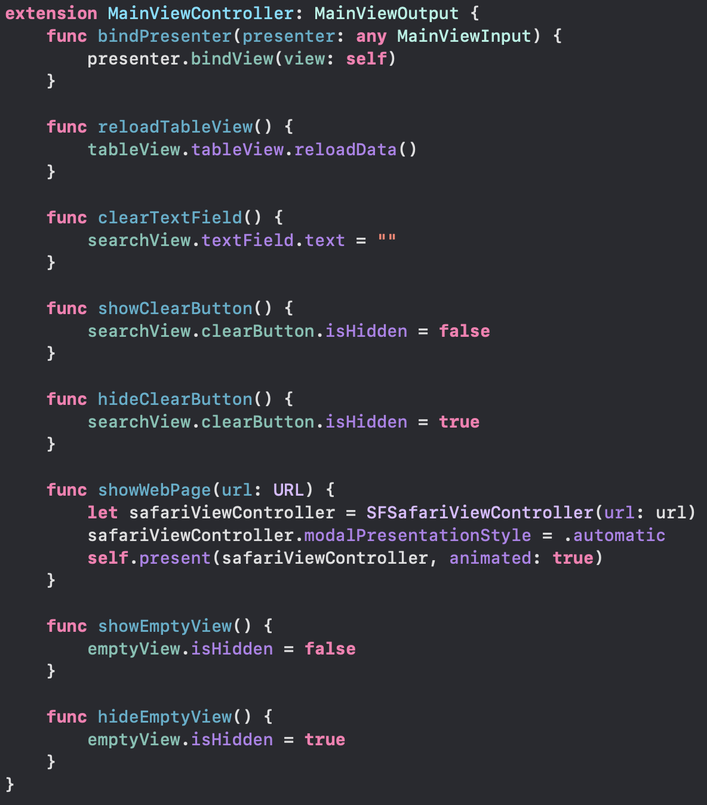
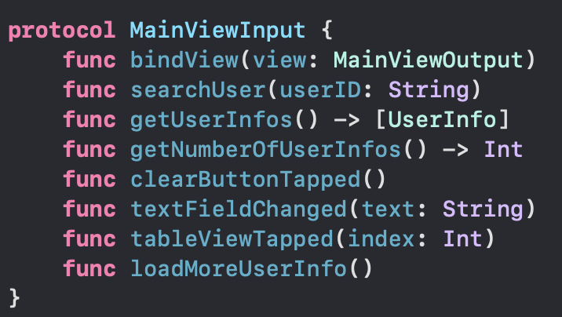
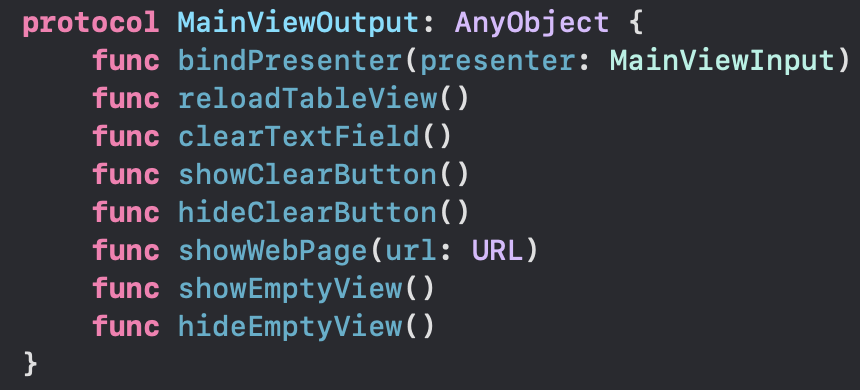
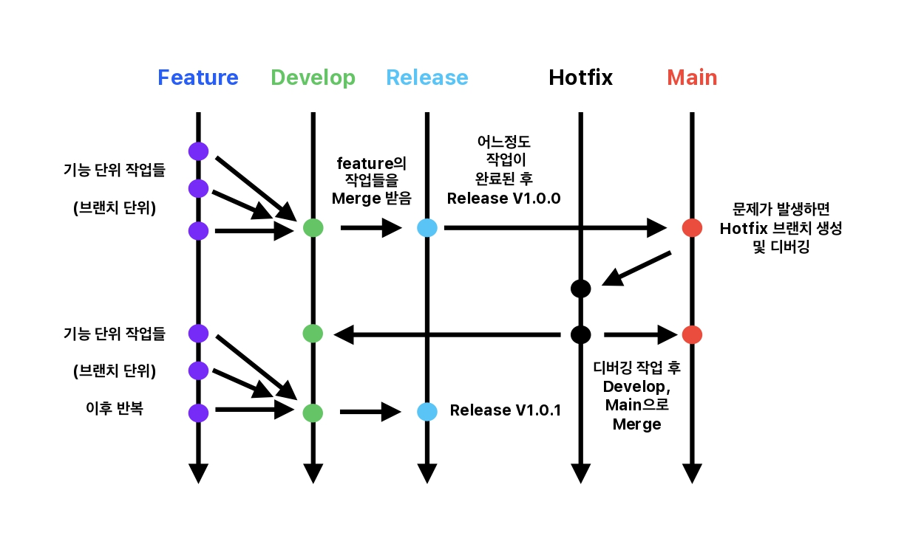
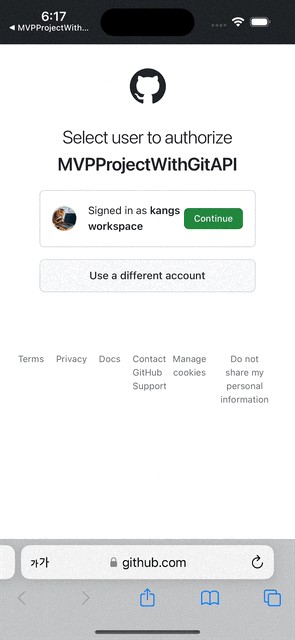
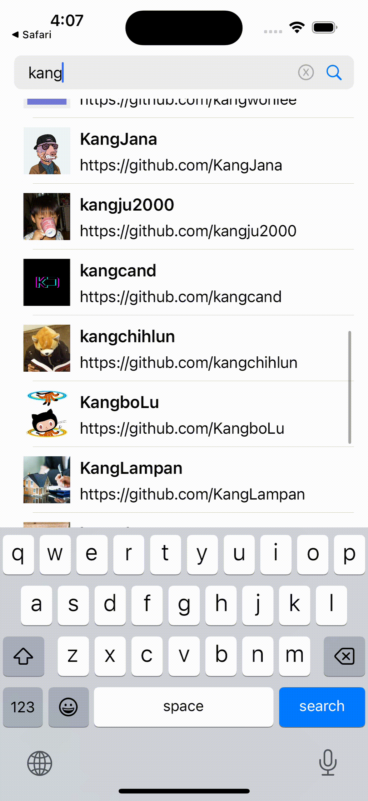
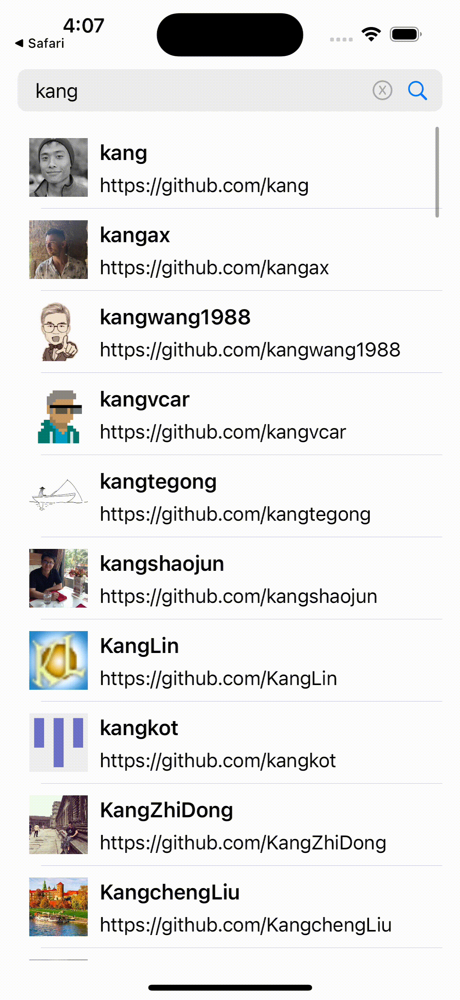

# MVPProjectWithGitAPI

  

### 프로젝트 소개(ProjectWithGitAPI)  
이전에 혼자 진행한 작은 프로젝트를 디자인 패턴을 맞추는 것에 중점을 두고 다시 프로젝트를 구성했습니다.  
당시에는 `MVVM` 아키텍처로 구현했었지만 진행하는 과정에서 스스로 디자인 패턴에 대한 이해도가 부족하다고 느꼈습니다.  
<br>
그래서 디자인 패턴을 다시 학습한 후 동일한 기능을 다양한 디자인 패턴으로 구현하는 프로젝트를 진행하고 있습니다.  
해당 프로젝트는 규모가 작지만, `API 사용`, `네트워킹`, `이미지 Caching`, `페이징 처리` 등 학습한 기술들을 적극 활용할 수 있었습니다.  
그래서 **ProjectWithGitAPI** 라는 이름으로 디자인 패턴을 공부하기 위한 프로젝트로 채택하게 되었습니다. 

- [MVVM 프로젝트 링크](https://github.com/kangsworkspace/MVVMProjectWithGitAPI)
- [MVC 프로젝트 링크](https://github.com/kangsworkspace/MVCProjectWithGitAPI)

### 학습한 내용  
#### MVP 패턴(Passive View)  
- `View`는 **UI**를 담당하였습니다.  
- `Presenter`는 **프레젠테이션 로직**과 **비즈니스 로직(View의 Input 대응 & Model에 전달)** 을 담당하였습니다.  
- `Model`은 **비즈니스 로직(데이터 fetch, entity 정의)** 을 담당하였습니다.  
- `Presenter`에서 `protocol` 통해 **`View`의 UI 업데이트를 직접 지시**하도록 하였습니다.  
   ex) `Presenter`에서 `View`의 `reloadTableView()` 실행
  
- [공부한 내용을 정리한 블로그 예정](https://github.com/kangsworkspace/MVCProjectWithGitAPI)

#### 의존성 주입  
- View와 Presenter를 프로토콜로 연결하는 과정에서 의존성 주입을 적용하였습니다.  
`MainViewController`의 생성자에 `MainViewInput` `protocol`을 파라미터로 설정하였습니다.   
```swift
// 의존성 주입
init(presenter: MainViewInput) {
    self.presenter = presenter
    super.init(nibName: nil, bundle: nil)
    
    bindPresenter(presenter: presenter)
}
```
그래서 `MainViewController`의 인스턴스를 생성할 때 외부에서  
`MainViewInput` `protocol`을 생성하여 주입하게 되었습니다.  

```swift
func scene(_ scene: UIScene, willConnectTo session: UISceneSession, options connectionOptions: UIScene.ConnectionOptions) {
    guard let windowScene = (scene as? UIWindowScene) else { return }
    
    window = UIWindow(windowScene: windowScene)
    
    let presenter = MainPresenter()
    window?.rootViewController = MainViewController(presenter: presenter)
    window?.makeKeyAndVisible()
    window?.overrideUserInterfaceStyle = .light
}
```  
그리고 `View`와 `Presenter`를 `protocol`로 연결해 의존성을 낮추고,  
`Extension`을 통해 함수를 정리하여 특정 함수의 대응을 강제하고 코드의 시인성을 높일 수 있었습니다.  
  

#### 아쉬운 점
- `Presenter`가 `View`의 UI를 직접 지시하는 과정에서 함수의 수가 늘어났습니다.  

  | |  | 
  |--|--|

유저의 `Input`을 `Presenter`에서 처리하고 다시 `Output`으로 UI 업데이트를 지시하는 과정이 다소 복잡했습니다.  
예를 들어 검색 결과가 없음을 알려주는 `emptyView`와 관련한 로직의 경우,  
검색 결과가 있는지 없는지에 대한 판단을 `Presenter`에서 하고 결과에 따라 UI를 설정하면서  
`showEmptyView()` `hideEmptyView()`로 함수를 나누어 선언하게 되었습니다.  
<br>
그리고 `TableViewCell`을 눌러서 해당 URL로 이동하는 경우에도  
바로 `View`에서 처리가 가능하지만 Presenter에 해당 Input을 알리고  
다시 `Presente`가 `View`에 해당 URL로 이동을 하도록 전달하는 과정을 거쳤습니다.

최대한 디자인 패턴을 준수하려는 의도였지만 기존에 진행했던 MVC, MVVM 패턴에 비해 함수가 많이 늘어난 것을 확인했습니다.  
결과적으로 MVP 패턴을 효율적으로는 준수하지 못했습니다.

### 작업 Flow - Git Flow
  - Main, Develop, Release, Hotfix, Feature로 브랜치를 관리하였습니다.
  - 작업 흐름은 다음과 같았습니다.


  - [Git Flow에 대한 내용을 정리한 블로그 예정](https://dev-kang.tistory.com/36)


### 개발 및 테스트 환경 버전
  - Xcode 15.3
  - iOS 16+
  - iPhone15 시뮬레이터
  - Portrait Only
  - LightMode Only 
### 프로젝트 실행 방법
```
프로젝트 빌드 시 Secrets.configs 파일이 필요합니다.
본 프로젝트 실행을 위해 파일이 필요할 시 spdlqjrkdrjs@naver.com으로 요청해주세요.
```
- git clone
```
git clone https://github.com/kangsworkspace/MVPProjectWithGitAPI
```
- 현재 브랜치가 main에 있는지 확인하십시오.
- Simulator 기기를 iPhone15로 설정하고 빌드합니다.
<br>

### 구현 내용(구현 내용은 다른 ProjectWithGitAPI와 동일합니다)
 - <b> 깃 로그인 구현(임시 코드 및 access_token 획득) </b>
 
   
 
 - <b> 커스텀 SearchView 구현 </b>
 
  | |  | 
  |--|--|
 
 - <b> API사용, 페이징 처리, 이미지 캐싱처리 구현 </b>
    

 - <b> URL주소로 이동(SafariServices) </b>
  

## Library
- [SnapKit](https://github.com/SnapKit/SnapKit): UI 레이아웃 잡는데 사용  
- [KingFisher](https://github.com/onevcat/Kingfisher): 이미지로 로드, 이미지 캐싱, 인디케이터에 사용   
- [Then](https://github.com/devxoul/Then): 코드 단축을 위해 사용  
- [Moya](https://github.com/Moya/Moya): 네트워킹에 사용  
